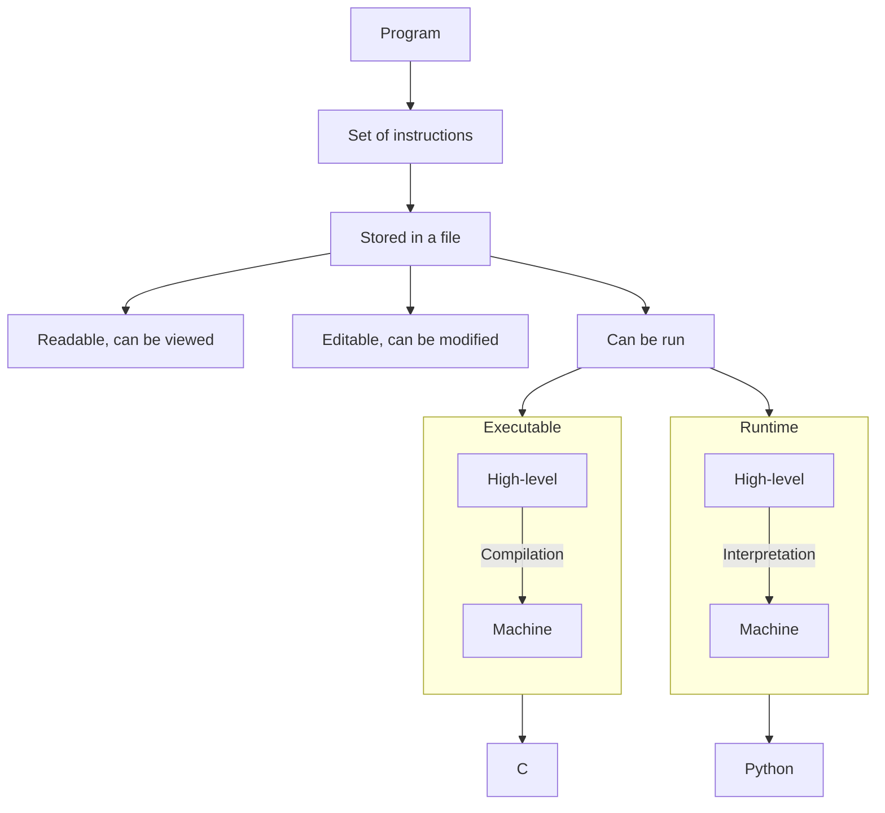
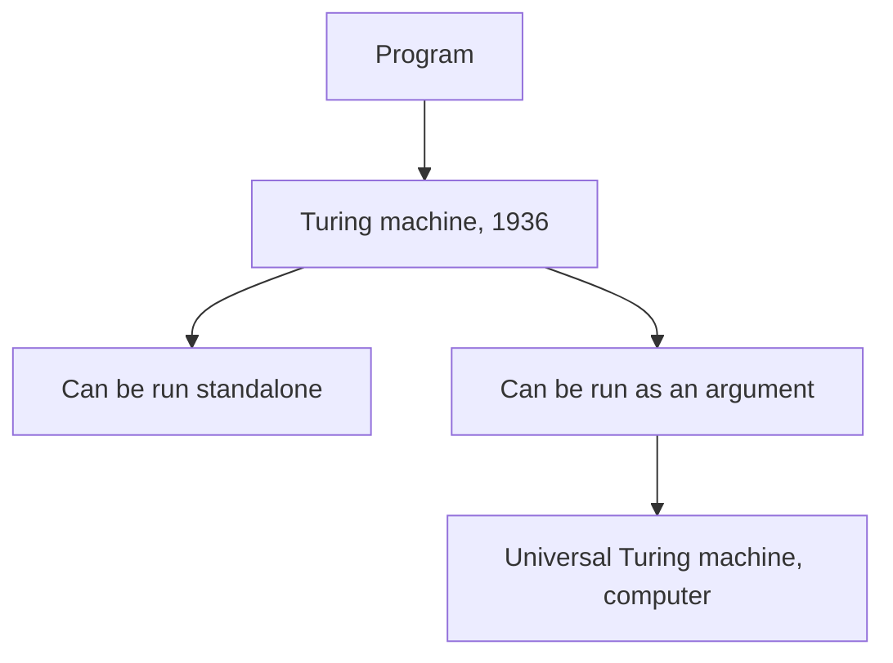
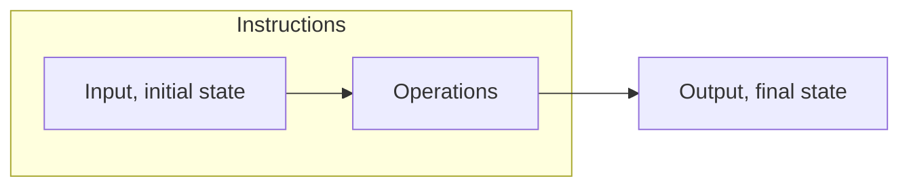
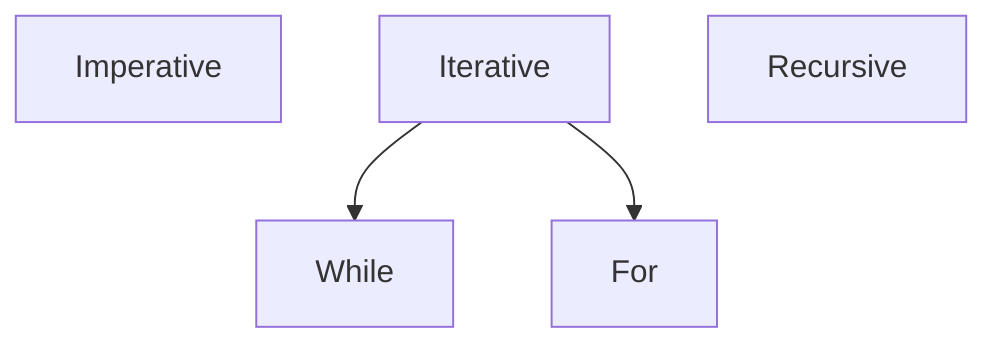

# Computer science
## 1.1 Basic concept of a program: the Turing machine

Source: [Serge BAYS, Numérique et sciences informatiques, 2e édition, 2022](https://www.editions-ellipses.fr/)

## What is a program?



### Interpreted vs compiled

```python
# Python is an interpreted language.

# When a Python script is run,
# the interpreter executes each line one by one:

print("Hello, world!") # Hello, world!
print(1 / 0)  # Error here --> STOP
print("Other code that won't be reached.")


# The program will terminate where the error lies.
```

```c
// C is a compiled language.

// If there is any unhandled error-prone code somewhere in the program,
// it will not compile and terminate (will not run at all).

#include <stdio.h>

int main(void) {
    printf("Hello, world!\n");
    int error = 1 / 0;  // Unhandled error here --> compilation will fail.
    printf("This line will not be executed\n");
    return 0;
}
```

### Turing machine



A basic example of a program: the Turing machine.

It encapsulates the fundamental concept of computing

(the basis for how all programs operate, from the simplest to the most complex):



```c#
// Simplest case.

public static class TuringMachine
{
    // Input: the machine receives a ribbonLength, an initial index and state
    public static void Machine(int ribbonLength, int index, int state)
    {
        // , , , , , , , , , , , , , , , , , , ,
        int?[] ribbon = new int?[ribbonLength];
        Console.WriteLine(string.Join(", ", ribbon));

        // Instructions: based on the state, the machine writes a value on the ribbon
        while (index < ribbon.Length)
        {
            if (state == 1)
            {
                if (ribbon[index] == null)
                {
                    // Operation 1
                    ribbon[index] = 1;
                    index += 1;
                    state = 2;
                }
            }

            else if (state == 2)
            {
                if (ribbon[index] == null)
                {
                    // Operation 2
                    ribbon[index] = 0;
                    index += 1;
                    state = 1;
                }
            }

            else
            {
                // If error, terminate the program
                index = ribbon.Length;
            }

        }

        // Output: final state
        // 1, 0, 1, 0, 1, 0, 1, 0, 1, 0, 1, 0, 1, 0, 1, 0, 1, 0, 1, 0
        Console.WriteLine(string.Join(", ", ribbon));
    }

    public static void Main()
    {
        Machine(20, 0, 1);
    }
}
```

```c#
// We can encapsulate instructions in a separate function TransitionTable().

public static class TuringMachine
{
    public static int TransitionTable(int?[] ribbon, int index, int state)
    {
        if (state == 1)
        {
            if (ribbon[index] == null)
            {
                ribbon[index] = 1;
                state = 2;
            }
        }

        else if (state == 2)
        {
            if (ribbon[index] == null)
            {
                ribbon[index] = 0;
                state = 1;
            }
        }

        else
        {
            index = ribbon.Length;
        }
        
        return state;
    }
    
    public static void Machine(int ribbonLength, int index, int state)
    {
        int?[] ribbon = new int?[ribbonLength];
        Console.WriteLine(string.Join(", ", ribbon));

        while (index < ribbon.Length)
        {
            state = TransitionTable(ribbon, index, state);
            index += 1;
        }

        Console.WriteLine(string.Join(", ", ribbon));
    }

    public static void Main()
    {
        Machine(20, 0, 1);
    }
}
```

```c#
// Furthermore, we can use recursiveness (calling the function itself)

public static class TuringMachine
{
    public static int TransitionTable(int?[] ribbon, int index, int state)
    {
        if (state == 1)
        {
            if (ribbon[index] == null)
            {
                ribbon[index] = 1;
                state = 2;
            }
        }

        else if (state == 2)
        {
            if (ribbon[index] == null)
            {
                ribbon[index] = 0;
                state = 1;
            }
        }

        else
        {
            index = ribbon.Length;
        }

        return state;
    }

    public static void Machine(int?[] ribbon, int index, int state)
    {
        // Termination code, otherwise infinite loop
        if (index < ribbon.Length)
        {
            state = TransitionTable(ribbon, index, state);
            Machine(ribbon, index + 1, state);
        }
    }

    public static void Main()
    {
        int ribbonLength = 20;
        int?[] ribbon = new int?[ribbonLength];

        // , , , , , , , , , , , , , , , , , , ,
        Console.WriteLine(string.Join(", ", ribbon));

        Machine(ribbon, 0, 1);
        
        // 1, 0, 1, 0, 1, 0, 1, 0, 1, 0, 1, 0, 1, 0, 1, 0, 1, 0, 1, 0
        Console.WriteLine(string.Join(", ", ribbon));
    }
}
```

### Programming styles

