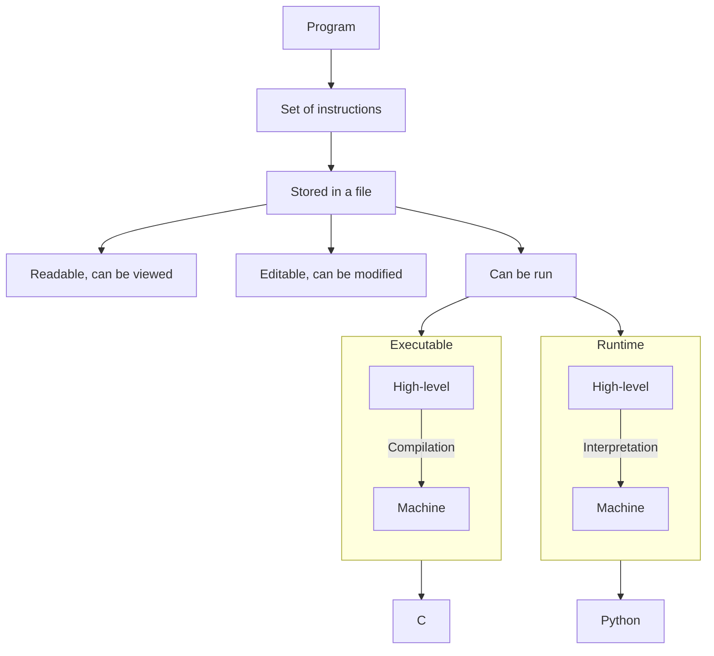

# Computer science

Source:

[Numérique et sciences informatiques](x)

## What is a program?



### Interpreted vs compiled

```python
# Python is an interpreted language.

# When a Python script is run,
# the interpreter executes each line one by one:

print("Hello, world!") # Hello, world!
print(1 / 0)  # Error here --> STOP
print("Other code that won't be reached.")


# The program will terminate where the error lies.
```

```c
// C is a compiled language.

// It can't be run at all if there is unhandled error-prone code.

#include <stdio.h>

int main(void) {
    printf("Hello, world!\n");
    int error = 1 / 0;  // This will cause a division by zero error
    printf("This line will not be executed\n");
    return 0;
}
```